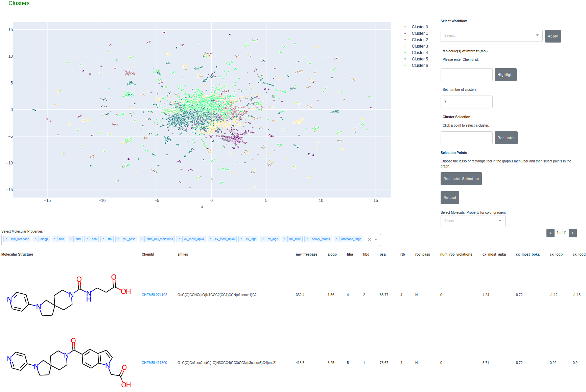

# Cheminformatics Clustering
---

### Introduction

A central task in drug discovery is searching, screening, and organizing large chemical databases.
Here, we implement clustering on molecular similarity. We support multiple methods to provide a interactive exploration of chemical space.

 - Compute Morgan circular fingerprints, cluster using k-means, and perform dimensionality reduction using PCA and UMAP. Distributed GPU-accelerated algorithms with multi-GPU support are used in this method. This allows processing very large datasets.
 - Compute Morgan circular fingerprints, [Sparse Random Projection](https://docs.rapids.ai/api/cuml/stable/api.html?highlight=sparserandomprojection#cuml.random_projection.SparseRandomProjection) and cluster using k-means.
 - Generate new molecules either by exploring the latent space between two molecules or sampling around a molecule



### Preparing the Environment (optional)
A launch script, `launch.sh`, is provided to perform all tasks.

#### Customization

The environment can be customized for control of the container, to create your own repo, or to store the data in a custom location. However, if this is not needed, skip to [Getting Started](#getting-started) to use the defaults.

To customize your local environment, edit the appropriate section of `launch.sh` or provide a `~/.cheminf_local_environment` file with the following information below.
To generate a template for `.cheminf_local_environment`, just run `./launch.sh` with no arguments.
If `.cheminf_local_environment` does not exist, then a template will be written for you.

```
CONT=nvcr.io/nvidia/clara/cheminformatics_demo:0.0.1
JUPYTER_PORT=8888
PLOTLY_PORT=5000
DASK_PORT=9001
PROJECT_PATH=/path/to/local/repo/dir
DATA_PATH=/path/to/scratch/space
DATA_MOUNT_PATH=/data
```

### Getting Started
Once your environment is setup, the following commands should be all you need.

Build your container:
```
./launch.sh build
```

Download the ChEMBL database (version 27):
```
./launch.sh dbSetup
```

Launch the dash interactive ChEMBL exploration tool:
```
./launch.sh dash
```

```
optional arguments:
  -h, --help            show this help message and exit
  --cpu                 Use CPU
  -b, --benchmark       Execute for benchmark
  -p PCA_COMPS, --pca_comps PCA_COMPS
                        Number of PCA components
  -n NUM_CLUSTERS, --num_clusters NUM_CLUSTERS
                        Numer of clusters
  -c CACHE_DIRECTORY, --cache_directory CACHE_DIRECTORY
                        Location to pick fingerprint from
  -m N_MOL, --n_mol N_MOL
                        Number of molecules for analysis. Use negative numbers
                        for using the whole dataset.
  --batch_size BATCH_SIZE
                        Chunksize.
  -o OUTPUT_DIR, --output_dir OUTPUT_DIR
                        Output directory for benchmark results
  --n_gpu N_GPU         Number of GPUs to use
  --n_cpu N_CPU         Number of CPU workers to use
  -d, --debug           Show debug message

```

Navigate a browser to:
```
https://0.0.0.0:5000
```

### Tutorial

See the [tutorial](tutorial/Tutorial.md) for an example walkthrough.

### Advanced Setup

#### Caching Fingerprints
Users can generate Morgan Fingerprints and store it in HDF5 files for later use. Please use the following command to generate fingerprint cache.
```
./launch.sh cache -c /data/fp
```

It is best to create the cache at `DATA_MOUNT_PATH` property defined in `~/.cheminf_local_environment`. Default value of this property is `/data/`. This is a mounted volumne from host and available for reuse beyond the container's lifetime.

Once generated, the cached fingerprints can be used for analysis using `-c` option.
```
./launch.sh dash -c /data/fp
```

### Conda

Conda environment support is available for user wanting to use the tool outside of containers. Please find the setup file in `setup` directory.

### Acceleration

The latest benchmarks reside in the [benchmark](benchmark) directory.

Benchmark tests run on A100:
  - [markdown](benchmark/A100/benchmark.md)
  - [Excel](benchmark/A100/benchmark.xlsx)
  - [plot](benchmark/A100/benchmark.png)

Benchmark tests run on V100:
  - [markdown](benchmark/V100/benchmark.md)
  - [Excel](benchmark/V100/benchmark.xlsx)
  - [plot](benchmark/V100/benchmark.png)

### Features

 - Cluster molecules from ChEMBL using the embedding generated from Morgan Fingerprints --> PCA --> UMAP
 - Ability to color the clustered molecules based on molecular properties
 - Ability to recluster on user selected subsets of molecules or specific clusters
 - Designate and track molecules of interest during the analysis
 - Generate new molecules by linearly interpolating the latent space between two selected molecules or sampling arround a selected molecule
 - Export generated molecules in SDF format