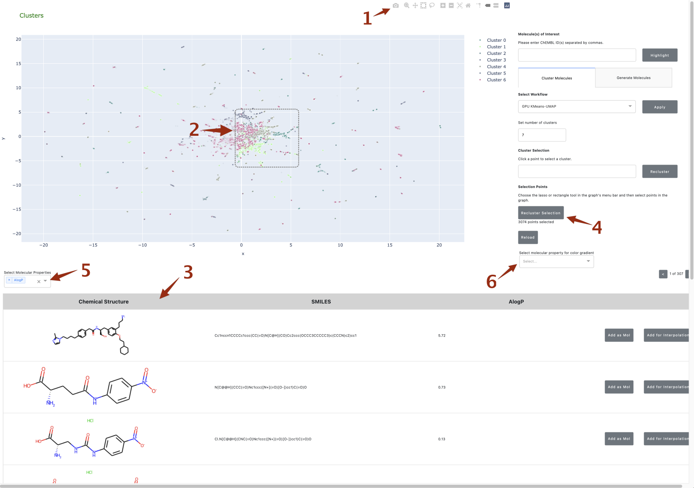
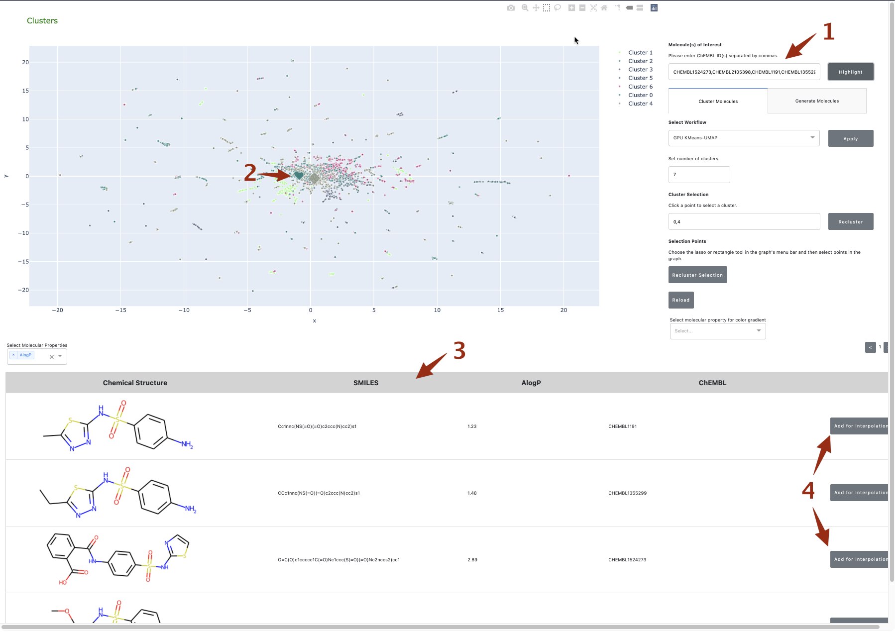

# Tutorial: Exploring the Chemical Landscape of anti-SARS-CoV-2 Virtual Screen Hits with NVIDIA Clara Discovery 

## Introduction

NVIDIA Clara Discovery is a collection of frameworks, applications, and models which combine accelerated computing, AI, and machine learning to accelerate the drug discovery process. This tutorial will demonstrate how Clara Discovery's cheminformatics search and generative modules can be used in the hit-to-lead stages of identifying a drug which inhibits a target from SARS-CoV-2. 

An early step in the drug discovery process is to identify compounds (or “hits”) that bind to the target. These hits are identified by a screen – either experimental or increasingly computational – and are often far from ideal as drugs. For example, they may bind to the target, but could also be toxic or have other off-target effects. Identification and optimization of leads, which resemble the hits but possess improved properties, is the next step. As with hit finding, the incorporation of AI and deep learning is accelerating what has traditionally been a time-consuming step. 

## Virtual Screen of ChEMBL Database for SARS-CoV-2 Drug Candidates

We will be utilizing the results of a virtual screen by [Tsuji](https://pubmed.ncbi.nlm.nih.gov/32374074/) in which the [ChEMBL database](https://www.ebi.ac.uk/chembl/) was screened for compounds which bind to 3-Chymotrypsin-Like Protease from SARS-CoV-2. 

First, the chemical neighborhood of hits identified from this screen will be explored using Clara Discovery's cheminformatics search tool. Then the generative module will utilize the latent space of the Seq2Seq model from [Winter and coworkers](https://github.com/jrwnter/cddd), called CDDD, to generate novel compounds with structures similar to the hit compound(s) that can be prioritized by the scientist for further study. The AI-generated compounds can be saved for further analysis.

## Setup and Data Preprocessing

To begin, follow the "Getting Started" steps in the [README](https://github.com/nvidia/cheminformatics#getting-started) of the NVIDIA Clara Discovery [repo](https://github.com/nvidia/cheminformatics). This will pull the Clara Discovery Cheminformatics container from NGC, download the ChEMBL database, and then featurize the compounds using Morgan Fingerprints. Finally, the Dash UI will be launched and can be loaded in a browser.

The Morgan Fingerprints are processed according to the selected workflow in the panel. This tutorial will focus on the default workflow, which uses RAPIDS (PCA and UMAP) for dimensionality reduction and K-Means for cluster assignment.

The Dash UI contains a subset of the compounds from ChEMBL processed according to the workflow and then displayed in the plot. They are colored according to their cluster assignment.

## Compound Selection and Reclustering

First, the visualization tools will be used to interact with and select the compounds plotted in the graph.

1. In the Plotly tools at the top of the window, choose either the Lasso Select or the Box Select tool.
2. Select a subset of compounds in the plot. The selected compounds will appear in the paginated table below. If desired, compounds of interest could be selected for tracking throughout the rest of the analysis (see section "Following Compounds of Interest" below) by pressing the "XXX" button in the table. 
3. Ensure the "Cluster Molecules" tab is selected in the panel on the right. Press "Recluster Selection" and the UI will recluster only the selected compounds and update the plot.
4. Molecular properties of interest can be added to the table using the drop-down menu "XXX".
5. By default, the plotted compounds are colored by cluster ID. However, they can also be colored by molecular property. The property can be selected in the drop-down menu labeled "Select molecular property for color gradient".  

As an alternative to the above interactive selection method, compounds can also be selected by cluster ID. A single cluster ID or a comma separated list of cluster IDs can be entered into the "Cluster Selection" box and then "Recluster" should be pressed in the box to the right.

## Following Compounds of Interest

Compounds of interest can be tracked throughout the analysis using their ChEMBL IDs. 

1. Add the following list of comma-separated ChEMBL IDs, based on hits identified in the anti-SARS-CoV-2 virtual screen, to the box labeled "Molecule(s) of Interest" and press "Highlight": 
> CHEMBL1524273,CHEMBL2105398,CHEMBL1191,CHEMBL1355299
2. The compounds will be added to the plot (if necessary) and represented with large diamonds. They will also appear in the table below -- these compounds of interest will be used in the next section.

## Generating Novel Compounds

The generative module can be used to sample novel molecules derived from the generative model's latent space that are either in the region surrounding one molecule of interest or located between two selected molecules. The second option will be explored below.

1. Ensure the list of ChEMBL IDs from the "Following Compounds of Interest" section are still present in the table below. For two of the compounds, select "XXX".
2. Choose the "Generate Molecules" tab in the panel to the right and select the "Interpolate between two molecules" radio button. Choose the tickbox next to two of the ChEMBL IDs.
3. Set the number of molecules to generate. Press "XXX" and wait for the molecule generation to complete. The model weights model may need time to download the first time this function is executed.
4. Generated molecules will appear in the table below with the original (selected) molecules at the top and bottom. The molecules can be exported in an SDF file by pressing the "XXX" button above the table.

As an alternative to the above workflow, molecules can be sampled in the vicinity of a single molecule by choosing the "XXX" radio button in step 2.
